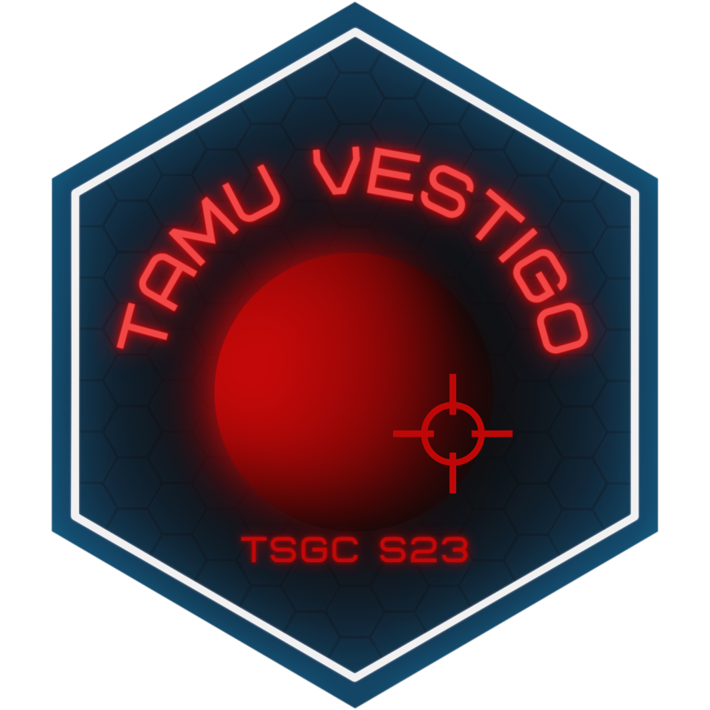

# Team-Vestigo

### Crew Tracking for Space Analog Research

Since 2014, NASA’s Johnson Space Center has been using the Human Exploration Research Analog (HERA) to simulate manned space missions on Earth. We are currently developing an upgrade to HERA that will track the location and orientation of crew members in real-time, enabling researchers to efficiently analyze metrics such as how long crew members spent in certain areas or next to other crew members. The challenge is to design a device that not only has sufficient accuracy and battery life, but also a compact size and minimal crew interaction. This project is part of the Texas Space Grant Consortium Design Challenge. 
